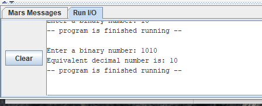

# Module 3 Challenge Activity: MIPS Procedures

- [Module 3 Challenge Activity: MIPS Procedures](#module-3-challenge-activity-mips-procedures)
	- [Learning Activities](#learning-activities)
	- [Purpose](#purpose)
	- [Skills and Knowledge](#skills-and-knowledge)
	- [Task 1: Ask user for Input](#task-1-ask-user-for-input)
		- [Sample Output Task 1](#sample-output-task-1)
	- [Task 2: Convert Binary to Decimal](#task-2-convert-binary-to-decimal)
		- [Procedure Algorithm Logic](#procedure-algorithm-logic)
		- [Test it in main](#test-it-in-main)
		- [Sample Output Task 2](#sample-output-task-2)
	- [Validate Code (optional)](#validate-code-optional)
	- [Submission Checklist](#submission-checklist)
	- [Other Resources](#other-resources)
		- [About Binary (Base-2)](#about-binary-base-2)
		- [Reference](#reference)
  
## Learning Activities

The learning activities related to this assignment are in the `la` folder of this project. If you need to review the concepts, follow the [LA description](la/README.md)

## Purpose

The purpose of this assignment in to help you understand how to use procedures or function in MIPS.

## Skills and Knowledge

The goal of this lab is to get some initial experience programming in MIPS assembly language. Specifically, by the end of this assignment, you should feel comfortable:

1. Manipulating registers
2. Doing logical operation on registers
3. Use of MIPS Procedures
4. Working with multiple files

## Task 1: Ask user for Input

Your first task is to collect user input and store it in memory. First, prompt the user to enter a value in binary notation. Then, store the input value in memory. For this, allocate some `16 bytes of space` in memory under the `bin_num` label.

Finally, print the value back to the screen.

Begin working in the file template (`ca.asm`) provided in the `ca` folder.

```mips
# Data for the program goes here
.data
prompt: .asciiz "Enter a binary number: "
bin_num: .space 16  # store up to 15 + NewLine Character

# Code goes here
.text
main:
 # Print prompt label

 # Collect user input, save it in bin_num

 # Print input label

end_main:
  li $v0, 10  # exit program syscall
  syscall

## end of ca.asm
```

### Sample Output Task 1


## Task 2: Convert Binary to Decimal

Your next task is to create a procedure called `binary_to_dec` that will convert a binary number, represented as a string (e.g. '101010'), to its decimal equivalent using first principles. The binary string is the value you collected on [Task 1](#task-1-ask-user-for-input). Given a binary input as string, your procedure should produce a decimal output.

Note: Implement the conversion yourself. Do not use something else to perform the conversion for you.

The procedure should have the following signature:

```mips
###############################################################
# Convert ascii string of binary digits to integer
#
# $a0 - input, pointer to null-terminated string of 1's and 0's (required)
# $v0 - output, integer form of binary string (required)
# $t0 - ascii value of the char pointed to (optional)
# $t1 - integer value (0 or 1) of the char pointed to (optional)

binary_to_dec:

 # loop over each character in the string

end_binary_to_dec:
        jr $ra
```

### Procedure Algorithm Logic

Your input binary number, comes in form of a string. You may use the following steps in your algorithm:

1. Set up a register as your `accumulator`.
2. Begin a loop over the string
3. Load the first byte of the string into a register
4. If the loaded byte is equal to `zero` (`beq`), exit the loop. This method will take care for strings in the form `.asciiz`.
5. If the loaded byte is equal to the `new line feed` (`beq`) which is the value of `0xa` in your ASCII table, exit the loop. This method will take care of input from the keyboard.
6. Shift your accumulator register 1 position to the left `sll`.
7. Subtract (`addi or subi`) the [ASCII](http://www.asciitable.com/) value from the loaded byte. For the character `'0'` is `0x30` or `48`.
8. Add new value to your accumulator register (`or`).
9. Move your pointer to the next character in the string (`addi` by 1).
10. Jump to the loop label.
11. When you exit the loop, "return" the accumulator in the `$v0` register.

### Test it in main

Remember that `before` you call the `binary_to_dec` procedure in `main`, make sure you set up the `$a0` register with the address of
the input string. The use of `$t0` and `$t1` inside your procedure algorithm are optional. However, the `$v0` register MUST have the return value from your procedure.

This is the value you will call in your `main` procedure. Finally, display the returned value with the appropriate message.

```mips
# Data for the program goes here
.data
prompt: .asciiz "Enter a binary number: "
result: .asciiz "Equivalent decimal number is: "
bin_num: .space 16  # store up to 15 + NewLine Character

# Code goes here
.text
main:
 # Print prompt label

 # Collect user input, save it in bin_num

 # Call binary_to_dec procedure

 # Print result message

end_main:
  li $v0, 10  # exit program syscall
  syscall

## end of ca.asm
```

### Sample Output Task 2

For input `'1010'` result = `10` decimal



For input `'101011'` result = `43` decimal


## Validate Code (optional)

## Submission Checklist

- [ ] Save and `commit` my code in github desktop
- [ ] `Push` the code to github.com
- [ ] Uploaded video of code walk-through  in `Canvas`
- [ ] Add your github repo as a comment to your assignment in `Canvas`.

## Other Resources

For more information on MIPS go to [How to page](HOWTO.md)

### About Binary (Base-2)

Decimal is a base-10 system.

A number 23 in base 10 notation can be understood
as a linear combination of powers of 10:

- The rightmost digit gets multiplied by 10^0 = 1
- The next number gets multiplied by 10^1 = 10
- ...
- The *n*th number gets multiplied by 10^*(n-1)*.
- All these values are summed.

So: `23 => 2*10^1 + 3*10^0 => 2*10 + 3*1 = 23 base 10`

Binary is similar, but uses powers of 2 rather than powers of 10.

So: `101 => 1*2^2 + 0*2^1 + 1*2^0 => 1*4 + 0*2 + 1*1 => 4 + 1 => 5 base 10`.

### Reference

All of Computer Science [http://www.wolframalpha.com/input/?i=binary&a=*C.binary-_*MathWorld-](http://www.wolframalpha.com/input/?i=binary&a=*C.binary-_*MathWorld-)
